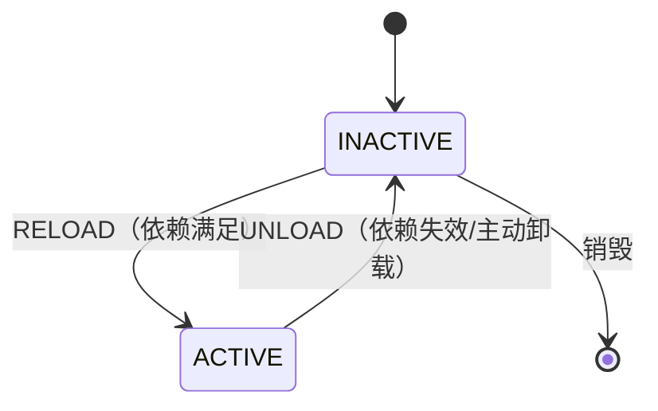

# 04-DSH-时空可组合论文.md

> **参考资料**——DeepSeek Harness（dsh）底座论文《A Programming Paradigm for Spatiotemporal Composability》专题摘要。本文对 02-DSH-架构 作底座深化，聚焦「万物皆插件」背后的形式化根基。

## 一、论文元信息

| 项 | 内容 |
|:--|:--|
| 标题 | A Programming Paradigm for Spatiotemporal Composability（一种面向时空可组合的编程范式） |
| 作者 | Yifan Shi（¹北京大学 ²DeepSeek-AI）、Wei Zhang（¹北京大学）、Tianyi Cui（²DeepSeek-AI，dsh 头号提交者） |
| 机构 | Peking University × DeepSeek-AI |
| 发表 | 预印本 · cordiverse/paper · Draft of Aug 13 2026 |
| 实现 | Cordis（cordiverse/cordis） |
| 案例 | Koishi（4000+ 生产环境社区插件） |

## 二、论文要解决的问题（一句话）

现代软件越来越需要**动态组合**——组件在运行时来了又走（插件系统、自演化 agent harness），但其形式基础一直没打牢。论文把编程语言理论里两个经典概念**从「编译期静态注解」下沉为「运行时可逆机制」**：

- **时间维 temporal**＝卸载时能否完全回滚副作用 → 对应 **effect（可逆副作用）**。
- **空间维 spatial**＝能否声明式、响应式地管理组件间依赖 → 对应 **coeffect（响应式依赖）**。

开篇动机（VSCode 插件生态实证）：top100 扩展中 **87 个**含可执行代码、需重启才能真正卸载；仅 **7 个**声明了 extensionDependencies；跨扩展拿到的导出 API **没有类型**。现实粗粒度绕过＝重启进程/容器（丢状态、重建慢）。

## 三、核心贡献（五条，据论文 §1.3）

1. **形式化可逆 effect（§3.1）**：每次 context 变换都携带显式逆元，由运行时 track；卸载时结构性完整回收。
2. **形式化响应式 coeffect（§3.2）**：组件把依赖声明为 typed dependency set，notify 把状态变迁分为 activating / deactivating / neutral。
3. **统一 context 类型 Γ∞（§3.3）**：把 effect context 与 coeffect context 合成单一类型，由 observational equivalence 赋予 effect 以 independence。
4. **动态组合演算（§4）**：以 component / fiber 为对象，给出生命周期 operational semantics，元性质含 Preservation / Temporal / Spatial / Progress / Confluence。
5. **Cordis 实现 + Koishi 案例（§5）**：core library（effect tracking + coeffect resolution）+ declarative loader（config reconciliation + HMR），Koishi 验证。

## 四、关键概念对（术语）

| 概念 | 含义 | 对 dsh 的落点 |
|:--|:--|:--|
| effect | 计算怎样**改变**环境（可逆） | dsh 的 effect / disposer 体系 |
| coeffect | 计算怎样**依赖**环境（响应式） | dsh 的 inject + fiber epoch |
| isolation realm | 同一 key 在不同 realm 解析不同值（运行时 ad-hoc 多态；多租户/沙箱） | dsh 的 isolate realm（agent preset 服务行） |
| interception | 对依赖访问附加横切策略，右偏合并，外层约束内层而不改组件 | dsh 的 fs/* / tools/* 事件 + policy adapter |
| 依赖序涌现 | 依赖者「后激活、先卸载」无需专门调度，从 notify 定义自然涌现 | dsh 插件树的激活/回收序 |

### 组件基础生命周期（论文 Fig.1）

> UNLOAD 触发时执行可逆 effect 的逆，把副作用完全回滚——「卸载一个组件＝它从没来过」。

## 五、论文证明了什么、又不证明什么（诚实边界，§1.7）

**证明**：可逆 effect 的组合保持（逆组合精确退回原点）；依赖序自然涌现；动态组合演算的元性质。

**不证明**：它**不是安全沙箱**。论文明确「沙箱需要语言之外的边界」，与 dsh 官方对 Code Mode 的定位「containment, not a security boundary」（权限同 bash）形成诚实共振。它对 RSI（递归自我改进）只**结构性解决「整合与回退」这一环**，不解决安全自改进问题。

## 六、论文 ↔ dsh 逐条映射

| 论文机制 | dsh 实现 |
|:--|:--|
| revertible effects | dsh 的 effect / disposer：每次注册都是副作用，插件卸载时撤销 |
| reactive coeffects | dsh 的 inject（模型可见上下文注入）+ fiber epoch |
| idempotent guard | dsh 的 effect iterator（重复注册幂等防护） |
| isolation realm | dsh 的 isolate realm（agent preset 服务行隔离） |
| interception | dsh 的 fs/* / tools/* / telemetry/* 事件 + policy adapter |
| 统一 context | dsh 的 ctx 键 service multiplexing（ctx.sessions / ctx.tools / ctx.agents / ctx.llm 等） |

dsh 工程落地要点（据 deepseek-ai/deepseek-harness docs/architecture.zh.md）：

- **Cordis 底座**：插件向共享上下文贡献服务、类型化事件与可逆副作用；「不存在需要打补丁的特权内核」。
- **profile × bundle × patch**：启动时按序叠加成插件树，patch 按 id 定位条目替换或插入。
- **事件四模式**：waterfall（必须 next()）/ serial（独立拦截点）/ parallel / emit——02-DSH-架构 只承接了 waterfall/serial 两模式，可补 parallel/emit。
- **会话日志不变量**：「模型可见 ⟺ 已记录」，一切抵达模型请求的内容都能从日志重建。

## 七、对传承殿的承接与启示（本项目所需参考）

已承接（见 02-DSH-架构 §十）：万物皆插件、6 子系统骨架、3 类事件 + 2 模式、frozen outcome、一键全验 10 项；Code Mode 待 Phase 4。

本文新增可吸收的语义：

1. **可逆 effect 与不可逆结果的边界**——插件的副作用要「可逆」（卸载回滚），治理决策的结果才「不可逆」（frozen outcome）。二者一正一反，可明确写入 02-概念/不可逆结果 的边界条款。
2. **事件四模式补全**——04-设计/数据模型/02-事件流 目前只承接 waterfall/serial，可补 parallel/emit 两模式，并标明各模式适用场景。
3. **isolation realm → 多角色沙箱隔离**——传承殿 4 分类角色卡（道祖/圣人/准圣/大罗）的权限隔离，可借鉴「同 key 不同 realm 不同值」的运行时多态。
4. **interception（右偏合并、外层约束不改组件）→ 验证分离的机制化**——policy adapter 在不改组件本身的前提下附加约束，与「验证者与生成者分离」同构。
5. **诚实边界 → 玉玺语义**——dsh 承认「containment 不是安全边界」，传承殿应承认「AI 生成的治理机制可执行但权威性差，人类确认（盖玉玺）是语言之外的必要边界」，即治理仍需人类最终确认。
6. **RSI 定位 → 无人开发目标**——dsh 只结构性解决「整合与回退」，传承殿「无人开发」目标需明确：治理引擎自身也受道四约束（规约与实现必有间隙），不能声称完备。

## 八、来源与证据边界

- 论文：cordiverse/paper 预印本（Draft of Aug 13 2026，据 PDF 及 source-truth 核实）
- dsh 官方：deepseek-ai/deepseek-harness docs/architecture.zh.md
- 第三方精读：xiaonancs/deepseek-harness-deep-dive（Part IV 论文研究 ch22/23）
- 证据等级：论文事实 [verified]；论文↔dsh 映射 [verified]/[inferred] 分档。

---

*传承殿 · 2026-08-28 · 本文由 AI 整理（无玉玺，待界主盖玉玺确认）*
*implements: 参考·DSH 时空可组合论文（可逆 effect / 响应式 coeffect）*
*falsifiable: 上线 1 个月，本文所引论文元信息/五条贡献/四模式/映射在 cordiverse/paper 与 deepseek-harness main 分支可逐条对验（机械判定：文档审查）*
