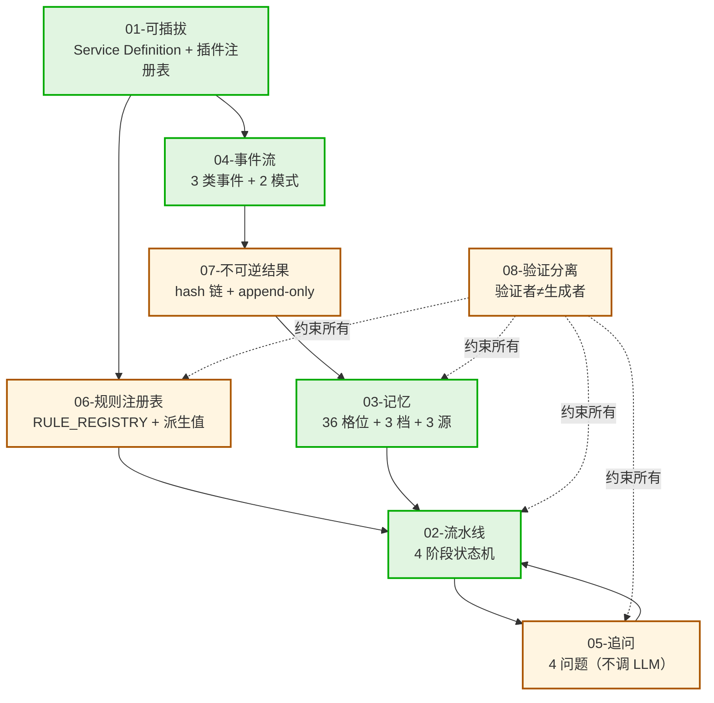
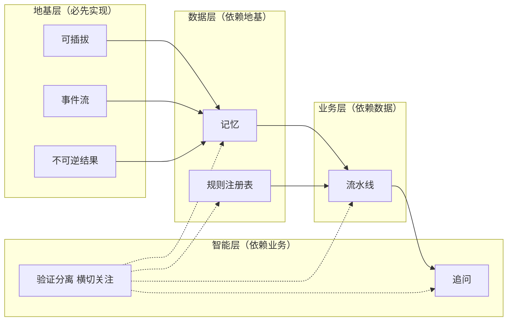

# 03-8-核心抽象依赖

> 中层视图——02-概念/ 8 份核心抽象的相互依赖关系。

## 一、8 个核心抽象

| # | 抽象 | 文件 |
|:--|:--|:--|
| 1 | 可插拔 | 02-概念/可插拔/01-可插拔.md |
| 2 | 流水线 | 02-概念/流水线/02-流水线.md |
| 3 | 记忆 | 02-概念/记忆/03-记忆.md |
| 4 | 事件流 | 02-概念/事件流/04-事件流.md |
| 5 | 追问 | 02-概念/追问/05-追问.md |
| 6 | 规则注册表 | 02-概念/规则注册表/06-规则注册表.md |
| 7 | 不可逆结果 | 02-概念/不可逆结果/07-不可逆结果.md |
| 8 | 验证分离 | 02-概念/验证分离/08-验证分离.md |

## 二、依赖关系图

## 三、依赖分层

## 四、因果链

1. **可插拔 → 事件流**（事件总线作为 Service Definition 实现）
2. **可插拔 → 规则注册表**（规则作为插件管理）
3. **事件流 → 不可逆结果**（不可逆性是事件流的实现）
4. **不可逆结果 → 记忆**（记忆条目必须不可改）
5. **记忆 + 规则注册表 → 流水线**（流水线的输入是记忆，规则约束流水线）
6. **流水线 → 追问**（追问是流水线的入口）
7. **追问 → 流水线**（追问结果驱动流水线）
8. **验证分离** 横切所有层

## 五、falsifiable

- 上线 1 个月：依赖图与实际 crate 依赖方向一致
- 上线 3 个月：删除任何"基础"层抽象后，"上层"抽象编译失败

---

*传承殿 · 2026-08-26 · decided_by: 界主*
*implements: 应（8 核心抽象依赖）*
