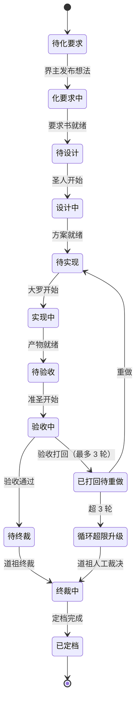
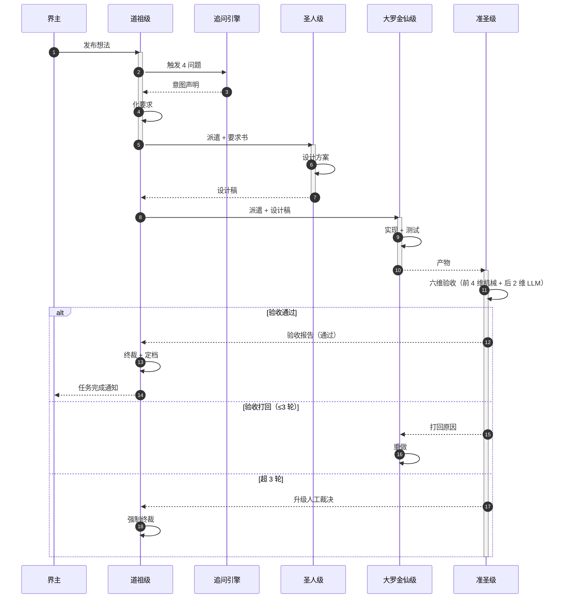
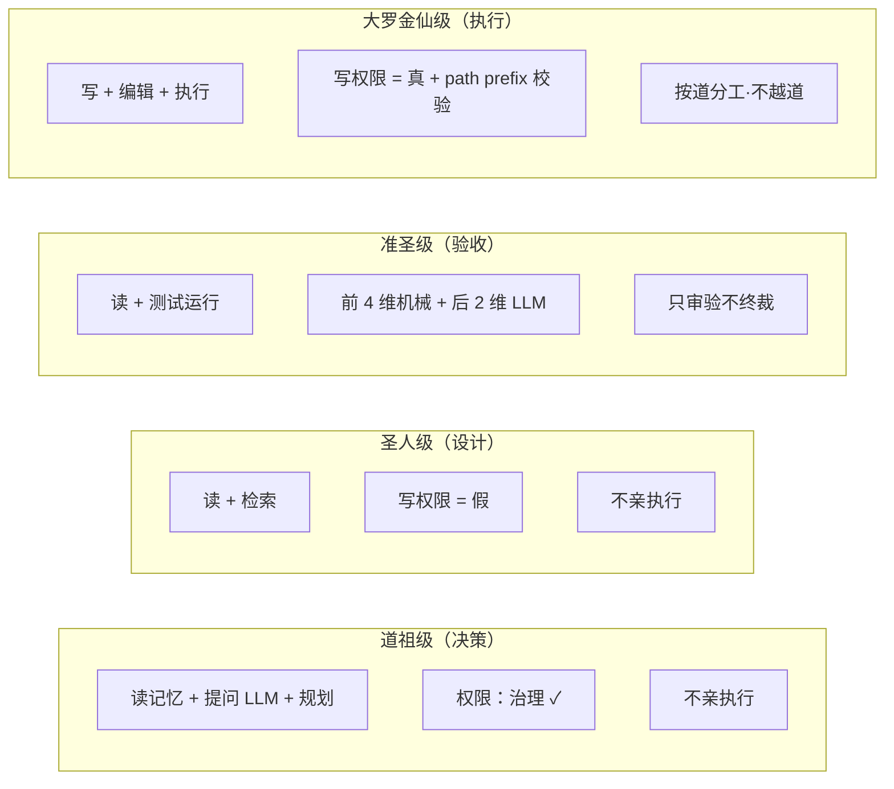

# 04-4-分类协作

> 中层视图——道祖/圣人/准圣/大罗金仙的流水线协作。

## 一、4 分类的状态转换

## 二、4 分类协作时序图

## 三、4 分类的能力与限制

## 四、falsifiable

- 上线 1 个月：状态机实现与图谱 100% 一致
- 上线 3 个月：跑通 1 个 e2e，4 分类协作 0 错误

---

*传承殿 · 2026-08-26 · decided_by: 界主*
*implements: 应·可视化（4 分类协作）*
