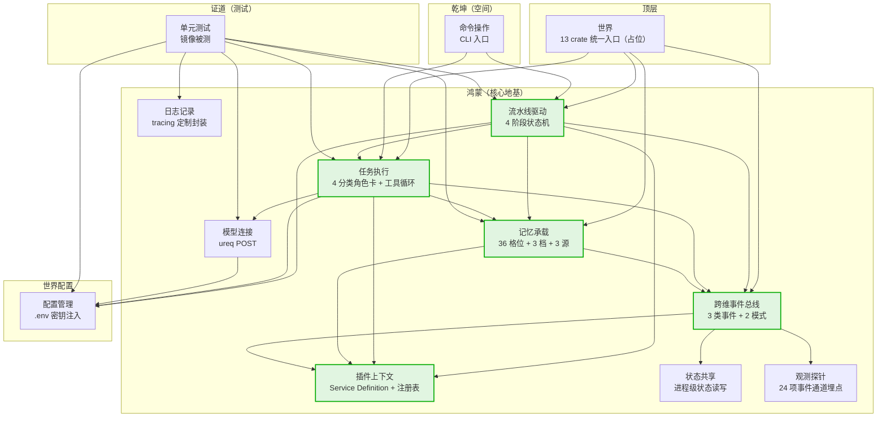
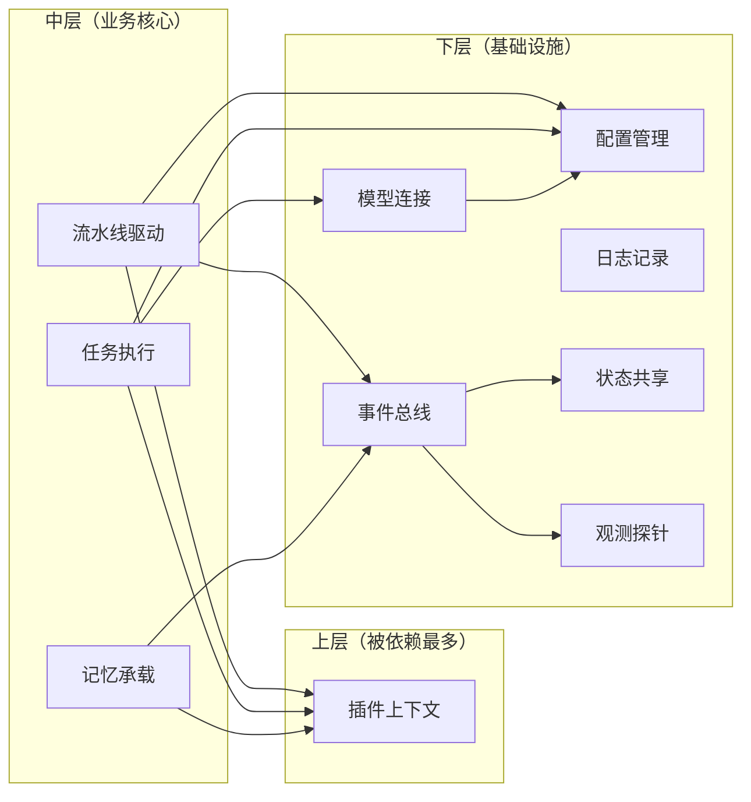

# 05-Cargo-workspace

> 底层视图——13 个 lib crate 的依赖方向。

## 一、13 个 lib crate 布局

## 二、依赖关系（按方向）

## 三、错误的依赖方向（禁止）

- ❌ 下层依赖上层（如 plugin 不应依赖 pipeline）
- ❌ 跨层直调（如 cli 不应直接调用 memory，应经 pipeline）
- ❌ 循环依赖（任何两个 crate 不能互引）

## 四、维度归属

| crate | 维度 | 域 | 备注 |
|:--|:--|:--|:--|
| plugin | 鸿蒙 | 基础设施 | 核心 |
| events | 鸿蒙 | 基础设施 | 核心 |
| memory | 鸿蒙 | 基础设施 | 核心 |
| state | 鸿蒙 | 基础设施 | |
| observe | 鸿蒙 | 基础设施 | |
| logging | 鸿蒙 | 基础设施 | |
| pipeline | 鸿蒙 | 基础设施 | 核心 |
| exec | 鸿蒙 | 基础设施 | 核心 |
| llm | 鸿蒙 | 基础设施 | |
| config | 鸿蒙 | 世界配置 | |
| cli | 乾坤 | 呈现 | |
| test | 证道 | 鸿蒙 | |
| world | 顶层 | — | 统一入口 |

## 五、falsifiable

- 上线 1 个月：cargo metadata 验证依赖方向 100% 合规
- 上线 3 个月：移除任何下层 crate，上层 crate 编译失败

---

*传承殿 · 2026-08-26 · decided_by: 界主*
*implements: 术·Cargo workspace 依赖图*
