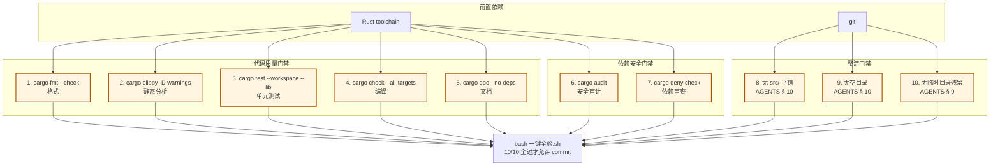
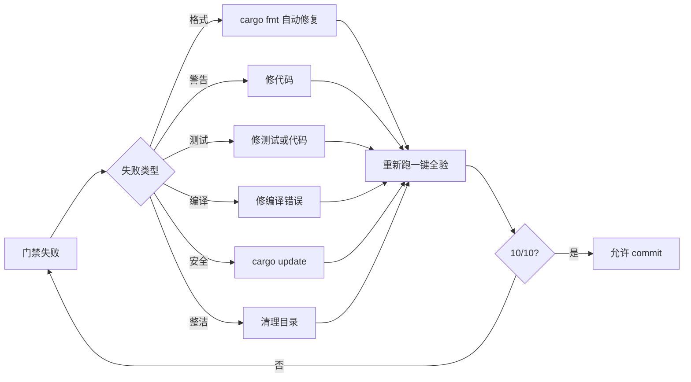

# 06-一键全验工具链

> 底层视图——10 项门禁的依赖关系。

## 一、10 项门禁

## 二、门禁触发时机

| 时机 | 门禁 |
|:--|:--|
| commit 前 | 1-5（代码质量） |
| commit 前 | 8-10（整洁） |
| Phase 末 | 6-7（依赖安全） |
| 部署前 | 全部 |

## 三、门禁失败的应急路径

## 四、falsifiable

- 上线 1 个月：一键全验 shell 脚本可工作
- 上线 3 个月：一键全验 10/10 全绿率 > 95%

---

*传承殿 · 2026-08-26 · decided_by: 界主*
*implements: 鉴
