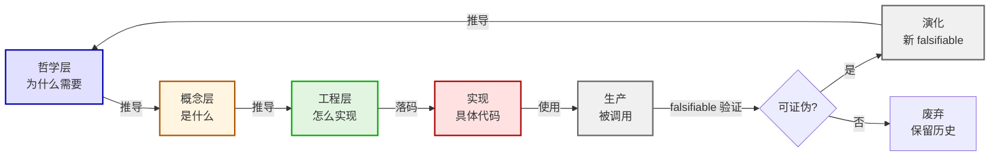

# 07-概念生命周期

> 生命图——核心概念从哲学推导到工程实现再到演化的完整生命周期。

## 一、生命周期

## 二、各阶段说明

| 阶段 | 输入 | 输出 | falsifiable |
|:--|:--|:--|:--|
| 哲学层 | 道-法-术-鉴-应-元 | 概念存在的因果必然性 | 哲学锚引用 |
| 概念层 | 哲学层 | 三条铁律 + 与相似概念的区分 | 三条铁律齐全 |
| 工程层 | 概念层 | 数据模型 + 接口契约 | 数据模型可编译 |
| 实现 | 工程层 | Rust crate + 测试 | 一键全验 10/10 |
| 生产 | 实现 | 被调用 + 事件流记录 | 调用次数 > 0 |
| 演化 | 生产 | 新 falsifiable 或废弃 | 上线后 6 个月复盘 |

## 三、决策点

1. 进入哲学层：界主发现新需求或外部锚定
2. 进入工程层：必须先通过概念层三条铁律
3. 进入实现：必须先有一键全验 10/10 的能力
4. 进入演化：必须上线 ≥ 3 个月 + 至少 1 次 falsifiable 验证
5. 废弃：必须保留历史决策（决策文档不删）

---

*传承殿 · 2026-08-26 · decided_by: 界主*
*implements: 道（概念从哲学到演化的完整路径）*
