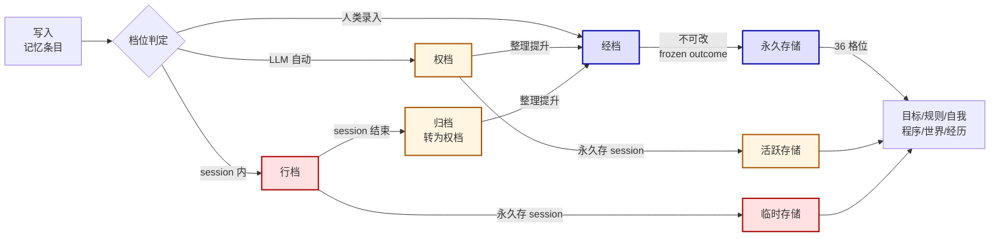

# 09-记忆生命周期

> 生命图——记忆条目从写入到归档的完整生命周期。

## 一、生命周期

## 二、3 档位流转规则

| 来源 | 行档（session） | 权档（当前 session） | 经档（永久） |
|:--|:--|:--|:--|
| LLM 可写？ | ✓ | ✓（需 decided_by） | ❌（仅建议） |
| 行档 → | 归档 | — | — |
| 权档 → | — | 整理提升 | — |
| 经档 → | — | — | 永久存储 |

## 三、经档的整理提升路径

- LLM 在权档写入教训 → 界主审查 → 提升为经档
- 行档 session 结束 → 自动归档为权档 → 整理提升为经档
- 关键教训直接由界主写入经档

---

*传承殿 · 2026-08-26 · decided_by: 界主*
*implements: 传承殿·传承（记忆是跨代际知识沉淀的载体）*
