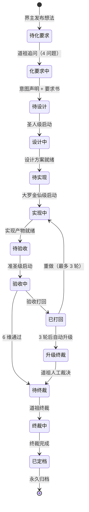

# 10-流水线生命周期

> 生命图——流水线任务从界主想法到定档归档的完整生命周期。

## 一、生命周期

## 二、各阶段关键点

| 阶段 | 关键点 | 时间上限 |
|:--|:--|:--|
| 道祖追问 | 4 问题（道二/顺因/有度/知止）必须全部回答 | 无 |
| 化要求 | 必须有 decided_by | 5 分钟 |
| 圣人设计 | 评审四元组（核心逻辑/异常/接口性能/数据流） | 30 分钟 |
| 大罗实现 | 按道分工（性能/数据/接口/监控） | 60 分钟 |
| 准圣验收 | 6 维（前 4 维机械 + 后 2 维 LLM） | 10 分钟 |
| 道祖终裁 | 多 LLM 投票或人工 | 5 分钟 |

## 三、循环打回机制

- 验收打回 → 大罗重做 → 准圣复验（最多 3 轮）
- 第 3 轮仍打回 → 自动升级道祖人工裁决
- 升级后：道祖可强制通过（但需 falsifiable 记录）

---

*传承殿 · 2026-08-26 · decided_by: 界主*
*implements: 道（4 分类协作的流水线）*
