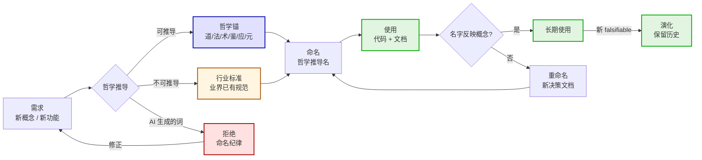

# 11-命名纪律生命周期

> 生命图——命名从需求到使用的完整生命周期。

## 一、生命周期

## 二、命名判断标准

### ✓ 可命名（哲学推导）

- 哲学锚（道/法/术/鉴/应/元 或五法）
- 行业标准（业界已有规范，引用即可）
- 哲学推导后产出的新词（如经档/权档/行档）

### ✗ 不可命名（AI 生成的词）

- 借来的词（乐高、工具 manifest）
- AI 味的修饰（智能-xxx、优雅-xxx）
- 过往实现的具体角色名（任意英文 snake_case 命名）

## 三、命名重命名流程

1. 新决策文档（带 decided_by + falsifiable + implements）
2. 代码全局替换（cargo fix + grep）
3. 文档同步（AGENTS § 风格契约 § 注释规范）
4. CI 验证（cargo build + cargo test）
5. commit 记录（commit message 引用决策 ID）

---

*传承殿 · 2026-08-26 · decided_by: 界主*
*implements: 法（哲学推导而非 AI 生成）*
