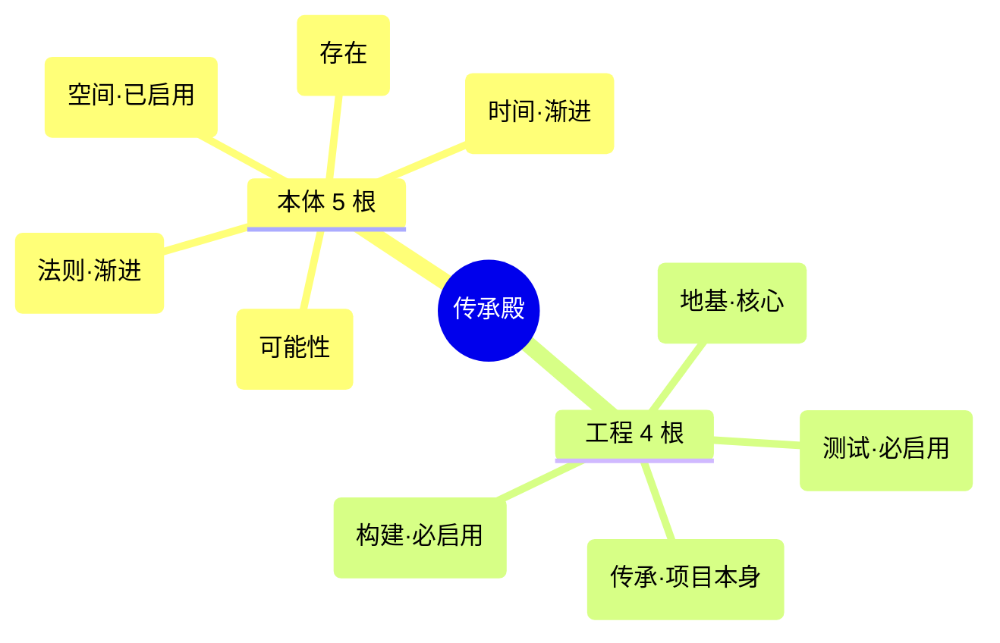
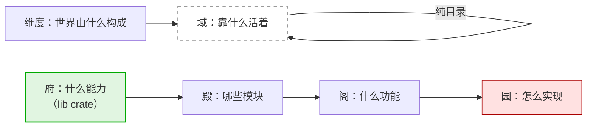
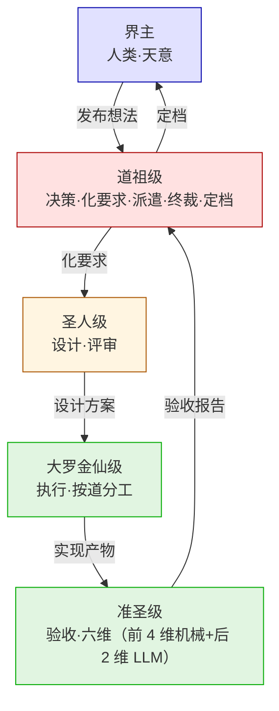
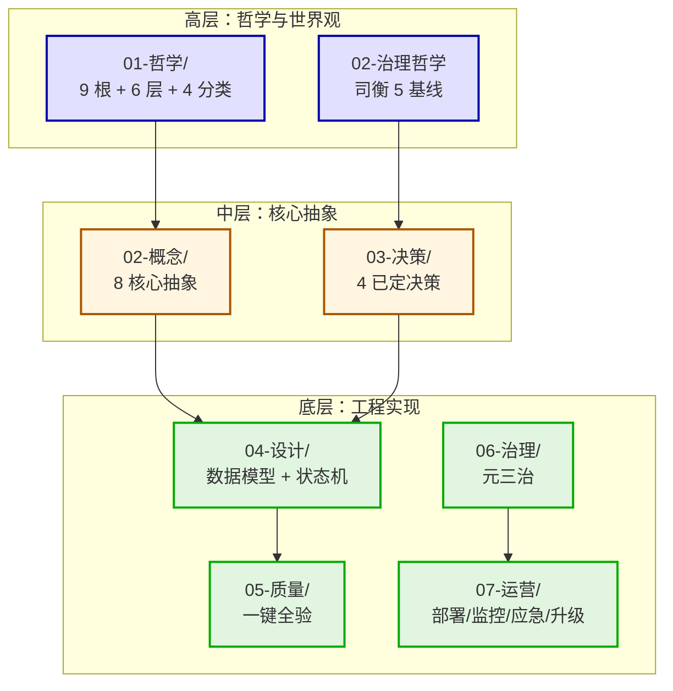

# 01-世界鸟瞰

> 高层视图——9 根维度 + 6 层结构 + 4 分类抽象的整体关系。

## 一、9 根维度（本体 5 + 工程 4）

## 二、6 层结构（跨维度通用）

## 三、4 分类抽象（角色）

## 四、整体鸟瞰（高中低三层 + 时间轴）

## 五、依赖关系

- 哲学文档（高层）→ 概念文档（中层）→ 设计文档（底层）的因果链单向
- 决策文档（中层）既受治理哲学驱动，又决定设计层细节
- 质量与治理层（底层）反向作用于所有上层

## falsifiable

- 上线 1 个月：图谱与代码实现一致性 100%
- 上线 3 个月：新人通过图谱能独立理解整体架构（无其他文档）

---

*传承殿 · 2026-08-26 · decided_by: 界主*
*implements: 应（高层视图一目了然）*
