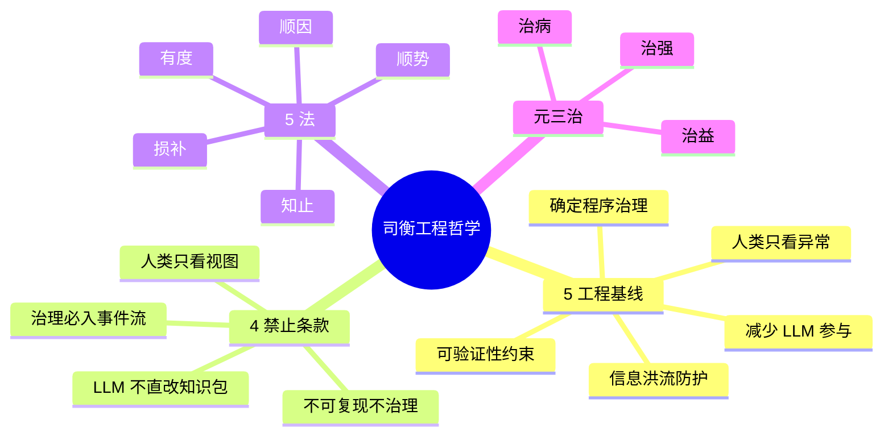
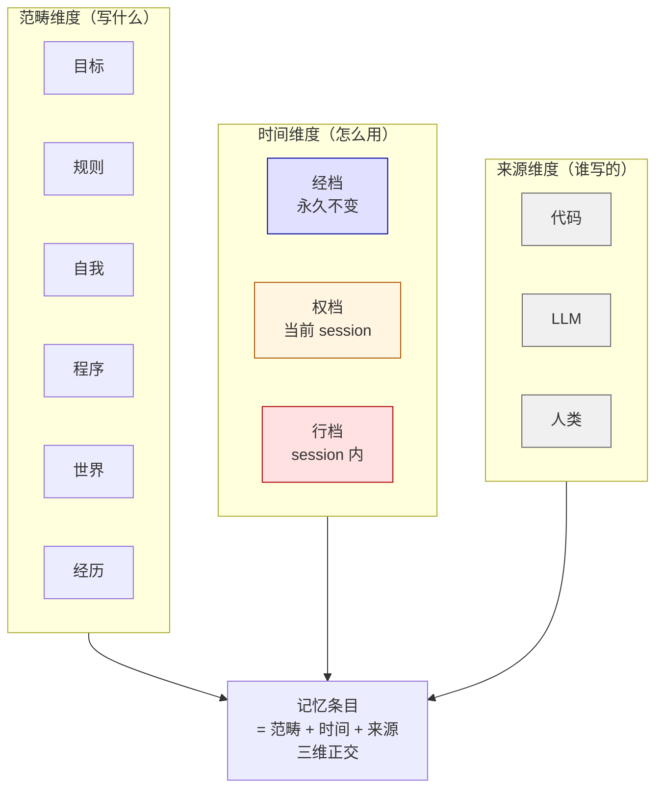
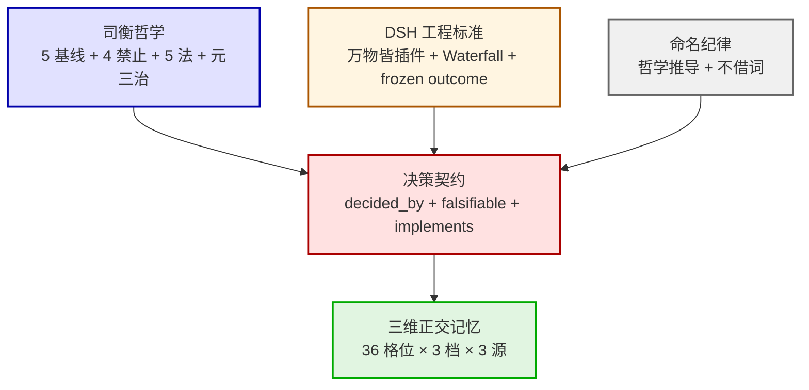

# 02-治理体系

> 高层视图——司衡基线 + DSH 标准 + 三维正交记忆模型。

## 一、司衡 5 基线 + 4 禁止 + 5 法 + 元三治



## 二、DSH 6 子系统 + 3 类事件 + 2 模式

```mermaid
flowchart LR
    subgraph 6子系统["DSH 6 子系统"]
        session[session<br/>会话日志]:::core
        prompt[system-prompt<br/>提示组装]
        tools[tools<br/>工具注册表]:::core
        agent[agent<br/>Agent 接口]:::core
        loop[agent-loop<br/>默认 driver]:::core
        scope[scope<br/>作用域原语]
    end

    subgraph 3类事件["3 类事件"]
        sessionEv[Session 事件<br/>持久化]:::ev
        agentEv[Agent 事件<br/>live]
        capEv[Capability 事件<br/>policy + adapter]
    end

    subgraph 2模式["2 模式"]
        water[Waterfall<br/>必须 next\(\) 链]
        serial[Serial<br/>独立拦截点]
    end

    session --> sessionEv
    agent --> agentEv
    tools --> capEv
    session --> water
    agent --> water
    prompt --> water
    tools --> water

    classDef core fill:#e1f5e1,stroke:#0a0
    classDef ev fill:#fff5e1,stroke:#a50
```

## 三、三维正交记忆模型



## 四、治理体系整体架构



## falsifiable

- 上线 1 个月：图谱与治理文档 100% 一致
- 上线 3 个月：新人通过此图能背诵 5 基线 + 4 禁止

---

*传承殿 · 2026-08-26 · decided_by: 界主*
*implements: 应（治理体系全貌）*
